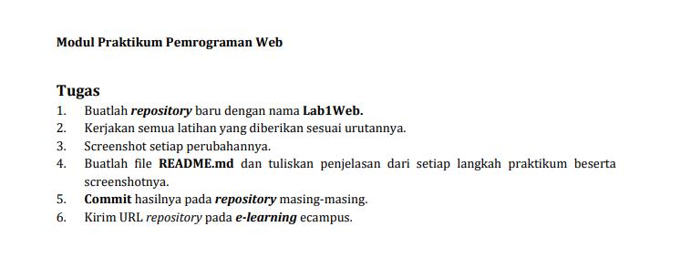
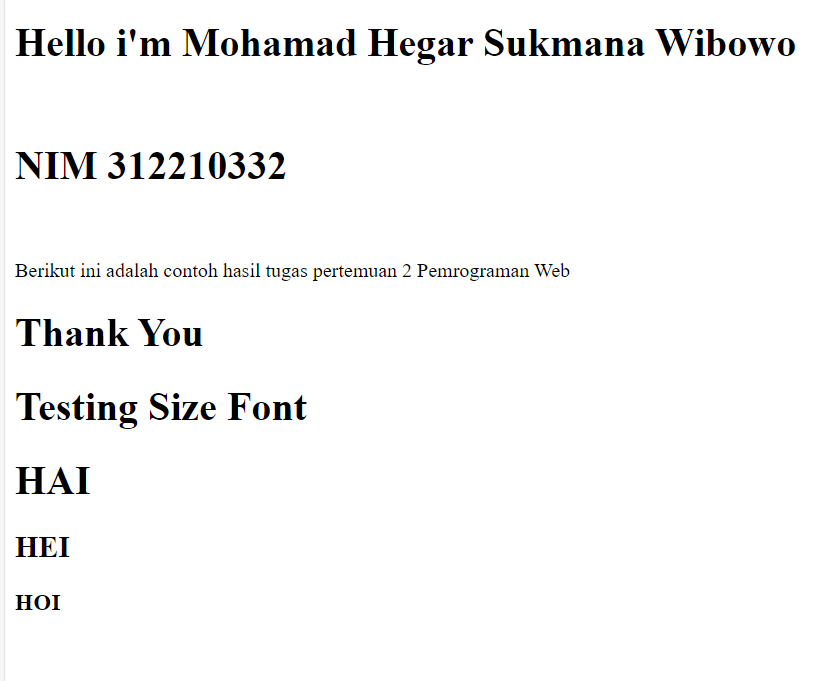
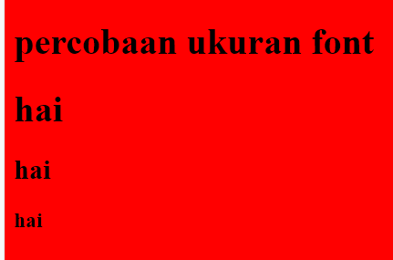
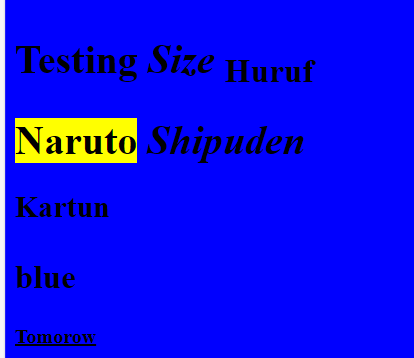

# Lab1web_
Tugas Pertemuan 2 Lab1Web
<br>
<h1>بِسْمِ اللهِ الرَّحْمٰنِ الرَّحِيْم<h1/>
<br>
<h2>Mohamad Hegar Sukmana Wibowo<h2/>
<h2>NIM 312210332<h2/>
<h2>TI.22.A3<h2/>
<br>

# Tugas

<hr>
<br>

# HTML
```<!DOCTYPE html>
<html>

<head>
<title>lab1web</title>
</head>
<body>

<h1>Hello i'm Mohamad Hegar Sukmana Wibowo</h1>
<br>
<h1>NIM 312210332</h1>
<br>
<p>Berikut ini adalah contoh hasil tugas pertemuan 2 Pemrograman Web</p>
<h1>Thank You<h1/>

<h1>Testing Size Font<h1/>
<h1>HAI<h1/>
<h2>HEI<h2/>
<h3>HOI<h3/>

</body>
</html>
```
<hr>
<br>

# Output
> berikut output dari HTML di Atas


# Penggunaan background dan Ukuran font
> Menggunakan Background merah dan ukuran font h1, h2, dan h3
```
<!DOCTYPE html>
<html>
<>
<head>
<title>Belajar HTML</title>
</head>
<body bgcolor = "red" >

<h1>percobaan ukuran font<h1/>
<h1>ONE PIECE<h1/>
<h2>FILM<h2/>
<h1>RED<h1/>
<h4>Coming soon<h4/>

</body>
</html>
```
# Output background dan font
> Background merah dan font ukuran h1, h2, h3



# Menggunakan fungsi format text
> Tag Keterangan
```
<b> Bold text
<strong> Important text
<i> Italic text
<em> Emphasized text
<mark> Marked text
<small> Smaller text
<del> Deleted text
<ins> Inserted text
<sub> Subscript text
<sup> Superscript text
```

syntax
```
<!DOCTYPE html>
<html>
<>
<head>
<title>Belajar HTML</title>
</head>
<body bgcolor = "red" >

<h1><b>percobaan</b> <i>ukuran</i> <sub>font</sub> <h1/>
<h1><mark>ONE</mark> <em>PIECE</em> <h1/>
<h2>FILM<h2/>
<h1><small>RED</small> <h1/>
<h4><ins>Coming soon</ins><h4/>

</body>
</html>
```
# Output


# Hyperlink
> Menampilkan tautan yang terhubung dengan link yang di tuju
<br>

```
<!DOCTYPE html>
<html>
<head>
<title>Belajar HTML</title>
</head>
<body bgcolor = "red">
<a href="https://ecampus.pelitabangsa.ac.id"><ins>klik untuk akses ke Ecampus Univeristas Pelita Bangsa<ins></a>
<br>
</body>
</html>
```
<br>

# Output Hyperlink

> Output Sebelum di klik


> Output Tujuan


> Output Setelah di gunakan (menunjukan perbedaan warna sesudah tautan di klik)


# Menampilkan Gambar

<br>

```
<!doctype html>
<html>
<head>
<title>Belajar HTML</title>
</head>
<body bgcolor = "red">

</body>
</html>
```

# Output Picture
> Menampilkan foto yang di pilih sesuai nama dan format


<h1> cukup sekian dan TERIMA KASIH</h1>
<br>

<h1>sandi bintara</h1>


